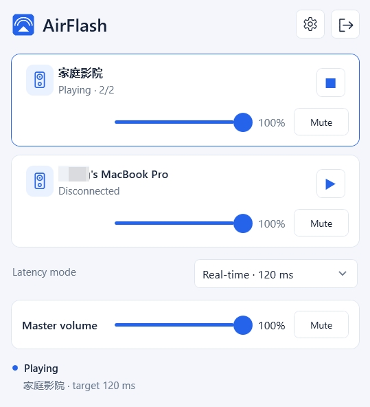

#  AirFlash

<p align="center">
  <a href="README.md">English</a> ·
  <a href="docs/README.zh-CN.md">简体中文</a>
</p>



Windows desktop audio streaming to HomePod over a native AirPlay 2 sender.
AirFlash supports existing two-device stereo pairs and low-latency playback
from Windows.

> **Status:** early-stage release. Hardware coverage is intentionally narrow.

## Installation

Download the latest release from [GitHub Releases](https://github.com/Ding-Kyoma/AirFlash/releases/latest), run
`AirFlash.msi`, and launch AirFlash from the installed shortcut. Apps and Features provides repair and uninstall.

AirFlash is distributed as a Windows x64 executable and standalone MSI. Windows may show
a SmartScreen warning because release binaries are not code-signed. Use
**More info** and **Run anyway** only when the downloaded files are from a
source you trust.

### Requirements

- Windows 10 or Windows 11, x64
- A Windows audio endpoint available through WASAPI
- Windows and HomePod on the same reachable local network

## Key features

- Captures Windows system audio through WASAPI and sends it to HomePod over a
  native Rust AirPlay 2 engine.
- Supports complete two-device HomePod stereo pairs with synchronized encrypted
  RTP sessions.
- Provides transient or PIN pairing, DNS-SD discovery, and manual receiver setup.
- Includes selectable latency profiles, tray operation, mute restoration,
  reconnects, and transport diagnostics.
- Uses bounded buffering, Rubato resampling, PTP timing, and PCM/ALAC packetization.
- Ships as a portable Windows x64 app with English and Simplified Chinese UI.

## Usage

1. Connect the PC and both HomePods to the same reachable local network.
2. Start AirFlash and wait for the receiver list to populate.
3. Select the complete `HomePod stereo · 2/2` entry and press play.
4. Complete PIN pairing in **Settings > Receivers** if the receiver requests it.
5. Choose the capture endpoint and latency profile in Settings when the defaults
   are not suitable.

AirFlash intentionally uses fresh application storage under `%APPDATA%/AirFlash`
and `%LOCALAPPDATA%/AirFlash`. It does not read configuration, credentials, or
engine caches created by the previous product name; users must configure and pair
again after installing AirFlash.

Use **Settings > About > Check for updates** to check for a stable release and open its download page. Checks run only when requested.

The real-time profile targets 120 ms; target and local transport timings are not measurements of end-to-end acoustic latency.

See [Release workflow](docs/RELEASING.md) for version reservation and publishing.

## Stack

- **C# / .NET 10 / WPF** for the Windows UI, tray integration, settings, and discovery
- **Rust** for WASAPI capture, AirPlay 2 sessions, HAP, PTP, RTP, and audio transport
- **Windows DNS-SD** for receiver discovery
- **WASAPI loopback** for system audio capture
- **PCM and ALAC** with encrypted RTP for HomePod playback
- **uv, pytest, and Ruff** for the finite validation tools and Python checks

The published application is self-contained and statically links the native MSVC runtime. It does not require Python, a separately installed .NET runtime, or a separately installed VC++ Redistributable.

## Development and build

Development requires Windows 10/11 x64, the .NET 10 SDK, the Rust MSVC toolchain,
and Visual Studio C++/Windows SDK components. Python 3.12+ and `uv` are used for
validation scripts only.

```powershell
uv sync --locked
pwsh scripts/build-native.ps1 -Check
pwsh scripts/dotnet.ps1 restore AirFlash.sln --locked-mode
pwsh scripts/dotnet.ps1 run --project AirFlash.App/AirFlash.App.csproj
pwsh scripts/build.ps1
```

The build produces:

- `dist/AirFlash.exe`
- `dist/AirFlash.msi`

Run `AirFlash.msi` directly. It installs the self-contained executable and provides optional desktop and Start menu shortcuts.
AirFlash uses the Windows DNS-SD API and does not require Bonjour or install a background service.
The Rust engine is embedded in the WPF executable and extracted to a content-addressed cache under `%LOCALAPPDATA%/AirFlash/engine/<hash>` at runtime.

## Tests

```powershell
pwsh scripts/dotnet.ps1 test AirFlash.sln
uv run pytest
uv run ruff check .
pwsh scripts/build-native.ps1 -Check
```

The ignored Rust soak test uses localhost UDP receivers only. Real HomePod tests
are intentionally limited to the repository's low-volume, five-second procedure.

## Contributing

Keep protocol behavior, pairing boundaries, and measurement limits explicit in
changes. Do not describe receiver negotiation or packet delivery as proof of
acoustic playback or end-to-end latency.

## License

Dual-licensed. AirFlash is available under the GNU General Public
License, version 3 or any later version (see [LICENSE-GPLv3](LICENSE-GPLv3)),
or under the AirFlash Commercial License (see
[LICENSE-COMMERCIAL.md](LICENSE-COMMERCIAL.md); contact
https://github.com/Ding-Kyoma/AirFlash/issues). Protocol implementation and dependency
notices are documented in
[native/airflash-engine/README.md](native/airflash-engine/README.md) and
[desktop/THIRD-PARTY-NOTICES.md](desktop/THIRD-PARTY-NOTICES.md).
