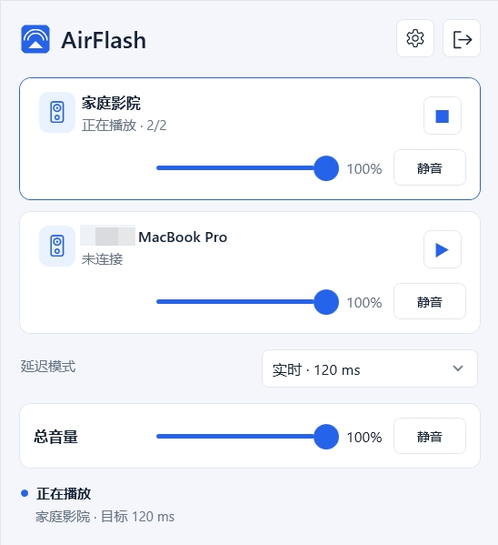

#  AirFlash

<p align="center">
  <a href="../README.md">English</a> ·
  <a href="README.zh-CN.md">简体中文</a>
</p>



通过原生 AirPlay 2 发送端，将 Windows 桌面声音低延迟发送到 HomePod。
AirFlash 支持现有的双 HomePod 立体声组合，并针对 Windows 音频播放场景
优化延迟。

> **状态：** 早期版本。当前硬件覆盖范围较窄。

## 安装

从 [GitHub Releases](https://github.com/Ding-Kyoma/AirFlash/releases/latest) 下载并运行 `AirFlash.msi` 安装，或直接运行便携版 `AirFlash.exe`。

AirFlash 提供 Windows x64 可执行文件和可独立运行的 MSI 安装包。由于发布文件没有代码签名，Windows
可能显示 SmartScreen 警告。只有在确认下载文件来源可信时，才使用“更多信息”
和“仍要运行”。

### 环境要求

- Windows 10 或 Windows 11，x64
- 可通过 WASAPI 使用的 Windows 音频端点
- 电脑与 HomePod 位于可互通的同一局域网

## 主要功能

- 使用原生 Rust AirPlay 2 引擎，通过 WASAPI 将 Windows 系统声音发送到 HomePod。
- 支持完整的双 HomePod 立体声组合，并使用同步的加密 RTP 会话。
- 支持临时或 PIN 配对、DNS-SD 发现和手动添加接收端。
- 提供延迟模式、托盘运行、静音恢复、断线重连和传输诊断。
- 使用有界缓冲、Rubato 重采样、PTP 时序以及 PCM/ALAC 封包。
- 提供便携式 Windows x64 程序、英文和简体中文界面。

## 使用方法

1. 将电脑和两台 HomePod 连接到同一可互通的局域网。
2. 启动 AirFlash，等待接收端列表出现。
3. 选择完整的 `HomePod stereo · 2/2` 项目并点击播放。
4. 如果接收端要求 PIN，在“设置 > 接收器”中完成配对。
5. 如果默认设置不合适，在设置中选择采集端点和延迟模式。

AirFlash 使用全新的应用数据目录 `%APPDATA%/AirFlash` 和
`%LOCALAPPDATA%/AirFlash`。它不会读取旧产品名称创建的配置、凭据或引擎
缓存；安装 AirFlash 后需要重新配置并重新配对。

在 **设置 > 关于 > 检查更新** 中手动查询正式版本并打开下载页；程序不会自动联网检查或安装更新。

实时模式目标延迟为 120 ms；目标值和本机传输统计不代表端到端声学延迟的实测值。

版本预留与发布方法见 [发布流程](RELEASING.md)。

## 技术栈

- **C# / .NET 10 / WPF**：Windows 界面、托盘、设置和设备发现
- **Rust**：WASAPI 采集、AirPlay 2、HAP、PTP、RTP 和音频传输
- **Windows DNS-SD**：接收端发现
- **WASAPI loopback**：系统声音采集
- **PCM 和 ALAC**：通过加密 RTP 发送到 HomePod
- **uv、pytest、Ruff**：限时验证工具和 Python 检查

发布程序自包含，Rust 引擎静态链接 MSVC 运行库，不需要 Python、单独安装 .NET 运行时或单独安装 VC++ Redistributable。

## 开发与构建

开发需要 Windows 10/11 x64、.NET 10 SDK、Rust MSVC 工具链，以及 Visual
Studio C++/Windows SDK 组件。Python 3.12+ 和 `uv` 仅用于验证脚本。

```powershell
uv sync --locked
pwsh scripts/build-native.ps1 -Check
pwsh scripts/dotnet.ps1 restore AirFlash.sln --locked-mode
pwsh scripts/dotnet.ps1 run --project AirFlash.App/AirFlash.App.csproj
pwsh scripts/build.ps1
```

构建生成：

- `dist/AirFlash.exe`
- `dist/AirFlash.msi`

Rust 引擎会嵌入 WPF 可执行文件，运行时释放到
`%LOCALAPPDATA%/AirFlash/engine/<hash>` 内容寻址缓存。

## 测试

```powershell
pwsh scripts/dotnet.ps1 test AirFlash.sln
uv run pytest
uv run ruff check .
pwsh scripts/build-native.ps1 -Check
```

被忽略的 Rust 压力测试只使用 localhost UDP 接收端。真实 HomePod 测试严格
遵守仓库规定的低音量、最长五秒流程。

## 贡献

修改时请明确协议行为、配对边界和测量限制。接收端协商成功或数据包发送成功，
不能直接证明声音已经播放或端到端延迟达标。

## 许可证

双重许可。AirFlash 可依据 GNU 通用公共许可证第 3 版或任何更高版本
（见 [LICENSE-GPLv3](../LICENSE-GPLv3)），或依据 AirFlash 商业授权
（见 [LICENSE-COMMERCIAL.md](../LICENSE-COMMERCIAL.md)；联系
https://github.com/Ding-Kyoma/AirFlash/issues）使用。协议实现和依赖声明见
[native/airflash-engine/README.md](../native/airflash-engine/README.md) 与
[desktop/THIRD-PARTY-NOTICES.md](../desktop/THIRD-PARTY-NOTICES.md)。
